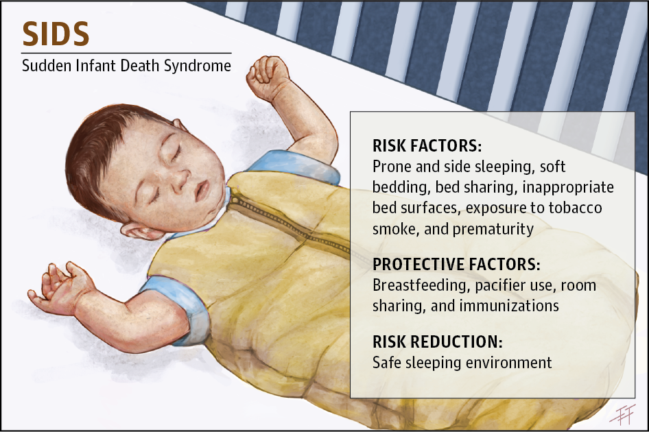

--- 
title: "SIDS-Related Mortality in Cook County, IL"
author: "Daniel P. Hall Riggins"
date: "`r Sys.Date()`"
site: bookdown::bookdown_site
documentclass: book
bibliography: [book.bib, packages.bib]
# url: your book url like https://bookdown.org/yihui/bookdown
# cover-image: path to the social sharing image like images/cover.jpg
description: |
  An public health analysis of SIDS-related mortality
biblio-style: apalike
csl: chicago-fullnote-bibliography.csl
---

# SIDS-Related Mortality in Cook County, IL

## Abstract

Although overall rates of Sudden Infant Death Syndrome are declining, dramatic racial disparities persist in many metropolitan regions, including Cook County, IL. In this analysis, we sought to identify specific micro-regions of the county where disparities have been most severe so that public health practitioners can target future interventions with high precision. We also sought to predictively model where SIDS incidence is expected to be highest based on census-level socio-ecologic factors. We hypothesized that the microregions with highest SIDS incidence would follow patterns of historic racial segregation. Similarly, we hypothesized that factors reflecting high levels of socioeconomic disadvantage would be predictive of high SIDS incidence. However, we were interested in identifying clusters in the city where are our model would not perform well with the hopes that studying these areas of poor predictive performance might identify new factors associated with particularly harmful or protective effects.

```{r echo=FALSE}

```

*Image credit to [JAMA Pediatrics](https://jamanetwork.com/journals/jamapediatrics/fullarticle/2599897)*

```{r include=FALSE}
# automatically create a bib database for R packages
knitr::write_bib(c(
  .packages(), 'bookdown', 'knitr', 'rmarkdown'
), 'packages.bib')
```
